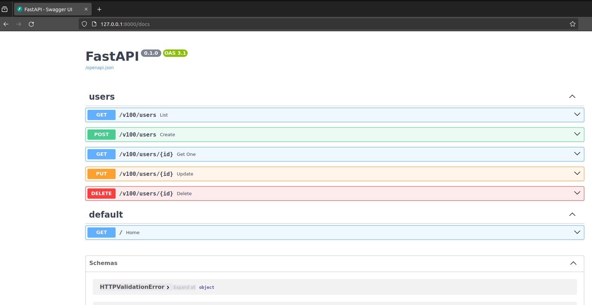
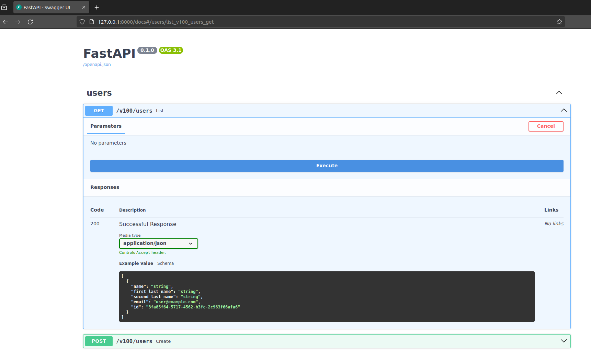
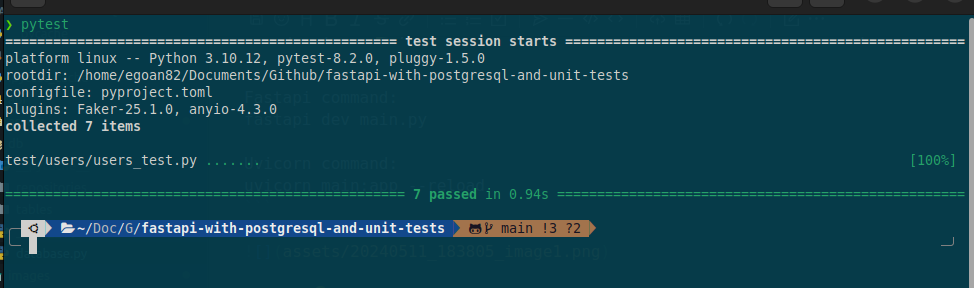
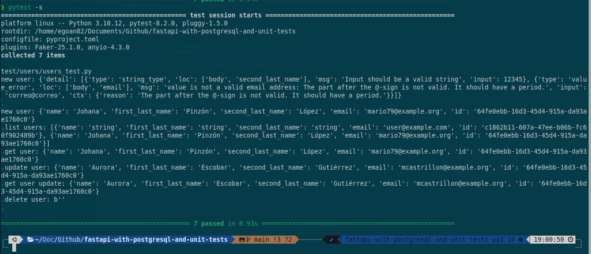

# Fastapi ⚡ with postgresql and unit tests 🚀️

##### In this project we will use fastapi to create an api and connect it to postgresql with sqlmodel to finish performing unit tests with pytest. This is an example project that you can download, modify and use to perform your own tests.

##### Now to execute this project I have used poetry as a virtual environment, which you can download and install according to its documentation, which you can verify in the following link:

##### [https://python-poetry.org/docs/#installation](https://)

##### You can also use venv as a virtual environment, you just have to install the dependencies 📥 that I list below:

```
fastapi
pydantic = {extras = ["email"], version = "^2.7.1"}
psycopg2-binary
sqlmodel
faker
pytest
```

##### 💻 Now with poetry installed we will execute the following commands, you must open a console that points to the root folder of the project 📂.

```
# This command creates and activates the virtual environment:
poetry shell

# This command installs all dependencies:
poetry install
```

##### 💻 Now that we have all the dependencies installed and we can run our project 📂, for which we can use one of the following commands:

```
Fastapi command:
fastapi dev main.py

Uvicorn command:
uvicorn main:app --reload
```



##### 💡 Now that we have our project running, we only need to configure the connection to the database, which you must do in 2 files 📄, one is the api project and the second is the test file.

```
DATABASE_URL = "YOUR CONNECTION"

Files:
db->database.py
test->users->users->users_test.py
```

##### 💡 This project automatically creates the users table, so there is no need to create it manually 🛠.

##### And we are ready to test our api, feel free to test each endpoint of the api 👨🏻‍🔧.



##### 💡 Finally we need to do our unit testing test, for which we will use pytest 🚧. You just need to run the command in the console:

```
pytest
```



##### ✅ Excellent, you are now running your unit tests, but as you can see the prints 📢 that we have in the test are not shown, if you want to see these prints 📢 in the console you must execute the following command:

```
pytest -s
```



##### 📢 As an extra bonus I have left the SQLite database connection commented in case you want to test with this database.

##### 👨🏻 I hope this small project is very useful for you to practice with fastapi ⚡, postgresql and unit tests. If it has been useful to you, don't forget to follow me and leave the repo a star 🌟.

##### See you in another project 🙋🏻

